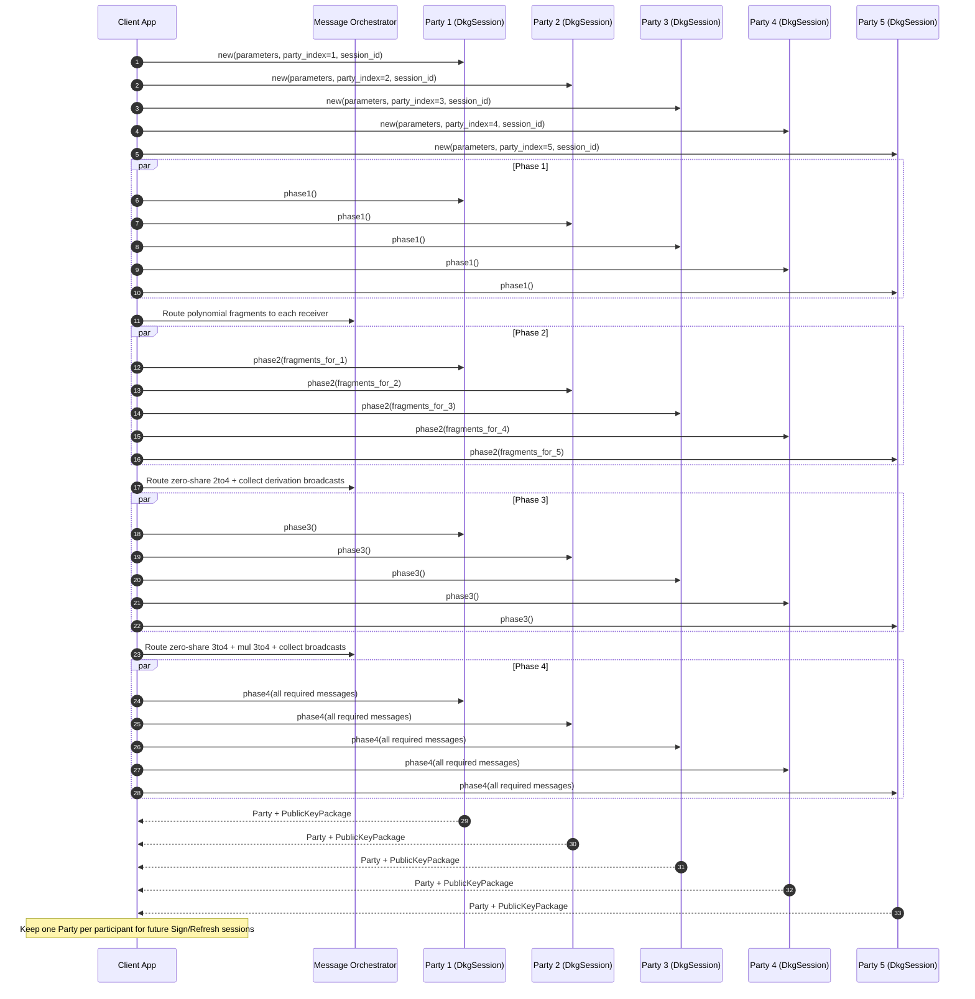
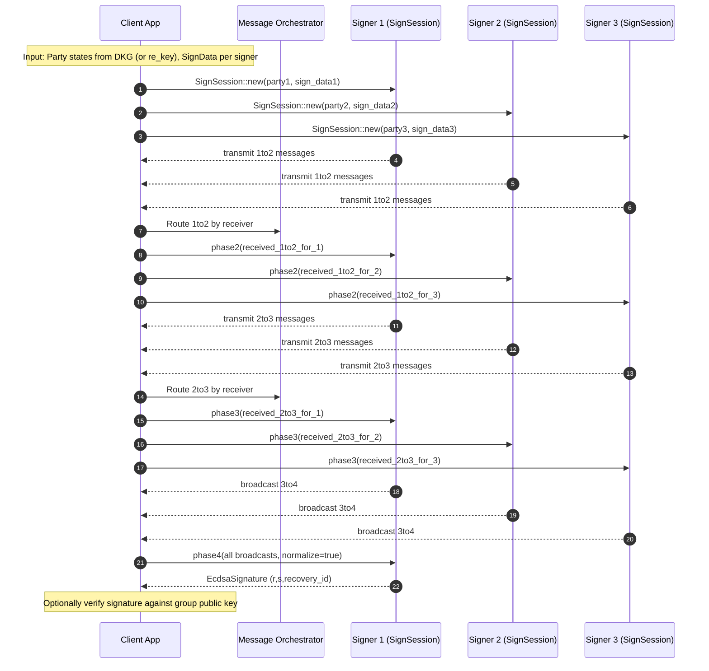
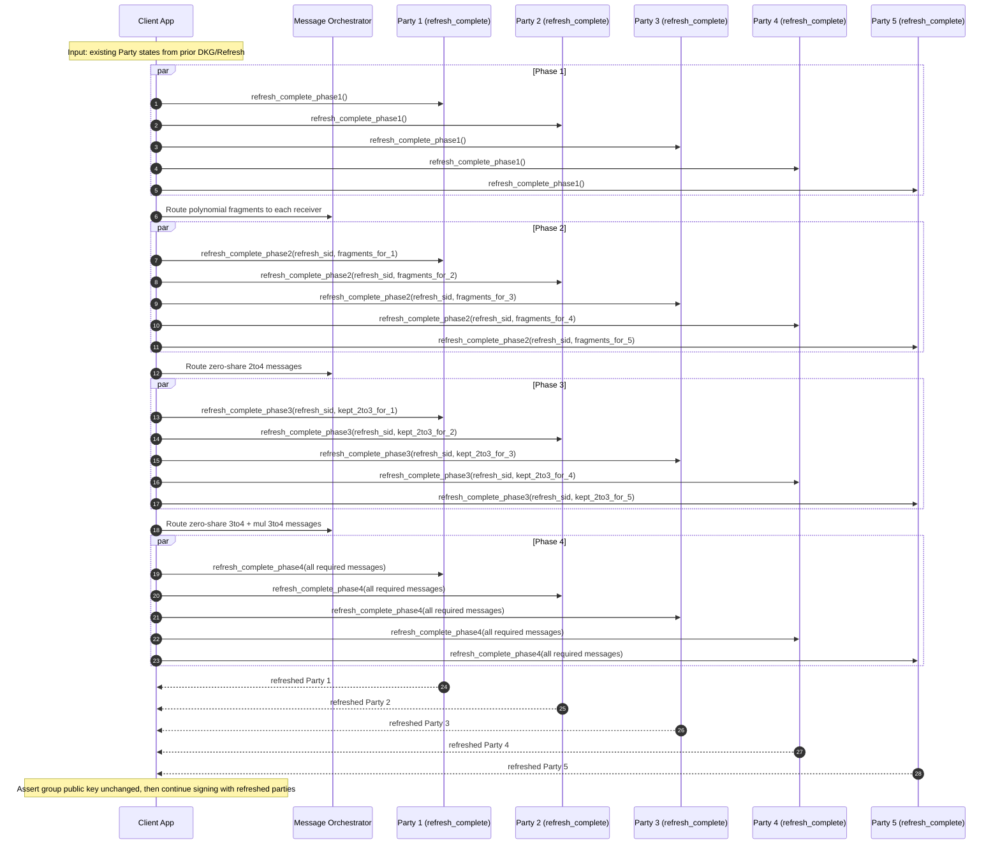

# DKLs23 Invocation Sequence Diagrams

## DKG

```mermaid
sequenceDiagram
    autonumber
    participant App as Client App
    participant Orchestrator as Message Orchestrator
    participant P1 as Party 1 (DkgSession)
    participant P2 as Party 2 (DkgSession)
    participant P3 as Party 3 (DkgSession)
    participant P4 as Party 4 (DkgSession)
    participant P5 as Party 5 (DkgSession)

    App->>P1: new(parameters, party_index=1, session_id)
    App->>P2: new(parameters, party_index=2, session_id)
    App->>P3: new(parameters, party_index=3, session_id)
    App->>P4: new(parameters, party_index=4, session_id)
    App->>P5: new(parameters, party_index=5, session_id)

    par Phase 1
      App->>P1: phase1()
      App->>P2: phase1()
      App->>P3: phase1()
      App->>P4: phase1()
      App->>P5: phase1()
    end

    App->>Orchestrator: Route polynomial fragments to each receiver

    par Phase 2
      App->>P1: phase2(fragments_for_1)
      App->>P2: phase2(fragments_for_2)
      App->>P3: phase2(fragments_for_3)
      App->>P4: phase2(fragments_for_4)
      App->>P5: phase2(fragments_for_5)
    end

    App->>Orchestrator: Route zero-share 2to4 + collect derivation broadcasts

    par Phase 3
      App->>P1: phase3()
      App->>P2: phase3()
      App->>P3: phase3()
      App->>P4: phase3()
      App->>P5: phase3()
    end

    App->>Orchestrator: Route zero-share 3to4 + mul 3to4 + collect broadcasts

    par Phase 4
      App->>P1: phase4(all required messages)
      App->>P2: phase4(all required messages)
      App->>P3: phase4(all required messages)
      App->>P4: phase4(all required messages)
      App->>P5: phase4(all required messages)
    end

    P1-->>App: Party + PublicKeyPackage
    P2-->>App: Party + PublicKeyPackage
    P3-->>App: Party + PublicKeyPackage
    P4-->>App: Party + PublicKeyPackage
    P5-->>App: Party + PublicKeyPackage

    Note over App: Keep one Party per participant for future Sign/Refresh sessions
```

## Sign

```mermaid
sequenceDiagram
    autonumber
    participant App as Client App
    participant Orchestrator as Message Orchestrator
    participant S1 as Signer 1 (SignSession)
    participant S2 as Signer 2 (SignSession)
    participant S3 as Signer 3 (SignSession)

    Note over App: Input: Party states from DKG (or re_key), SignData per signer

    App->>S1: SignSession::new(party1, sign_data1)
    App->>S2: SignSession::new(party2, sign_data2)
    App->>S3: SignSession::new(party3, sign_data3)

    S1-->>App: transmit 1to2 messages
    S2-->>App: transmit 1to2 messages
    S3-->>App: transmit 1to2 messages
    App->>Orchestrator: Route 1to2 by receiver

    App->>S1: phase2(received_1to2_for_1)
    App->>S2: phase2(received_1to2_for_2)
    App->>S3: phase2(received_1to2_for_3)

    S1-->>App: transmit 2to3 messages
    S2-->>App: transmit 2to3 messages
    S3-->>App: transmit 2to3 messages
    App->>Orchestrator: Route 2to3 by receiver

    App->>S1: phase3(received_2to3_for_1)
    App->>S2: phase3(received_2to3_for_2)
    App->>S3: phase3(received_2to3_for_3)

    S1-->>App: broadcast 3to4
    S2-->>App: broadcast 3to4
    S3-->>App: broadcast 3to4

    App->>S1: phase4(all broadcasts, normalize=true)
    S1-->>App: EcdsaSignature (r,s,recovery_id)

    Note over App: Optionally verify signature against group public key
```

## Refresh (Complete)

```mermaid
sequenceDiagram
    autonumber
    participant App as Client App
    participant Orchestrator as Message Orchestrator
    participant P1 as Party 1 (refresh_complete)
    participant P2 as Party 2 (refresh_complete)
    participant P3 as Party 3 (refresh_complete)
    participant P4 as Party 4 (refresh_complete)
    participant P5 as Party 5 (refresh_complete)

    Note over App: Input: existing Party states from prior DKG/Refresh

    par Phase 1
      App->>P1: refresh_complete_phase1()
      App->>P2: refresh_complete_phase1()
      App->>P3: refresh_complete_phase1()
      App->>P4: refresh_complete_phase1()
      App->>P5: refresh_complete_phase1()
    end

    App->>Orchestrator: Route polynomial fragments to each receiver

    par Phase 2
      App->>P1: refresh_complete_phase2(refresh_sid, fragments_for_1)
      App->>P2: refresh_complete_phase2(refresh_sid, fragments_for_2)
      App->>P3: refresh_complete_phase2(refresh_sid, fragments_for_3)
      App->>P4: refresh_complete_phase2(refresh_sid, fragments_for_4)
      App->>P5: refresh_complete_phase2(refresh_sid, fragments_for_5)
    end

    App->>Orchestrator: Route zero-share 2to4 messages

    par Phase 3
      App->>P1: refresh_complete_phase3(refresh_sid, kept_2to3_for_1)
      App->>P2: refresh_complete_phase3(refresh_sid, kept_2to3_for_2)
      App->>P3: refresh_complete_phase3(refresh_sid, kept_2to3_for_3)
      App->>P4: refresh_complete_phase3(refresh_sid, kept_2to3_for_4)
      App->>P5: refresh_complete_phase3(refresh_sid, kept_2to3_for_5)
    end

    App->>Orchestrator: Route zero-share 3to4 + mul 3to4 messages

    par Phase 4
      App->>P1: refresh_complete_phase4(all required messages)
      App->>P2: refresh_complete_phase4(all required messages)
      App->>P3: refresh_complete_phase4(all required messages)
      App->>P4: refresh_complete_phase4(all required messages)
      App->>P5: refresh_complete_phase4(all required messages)
    end

    P1-->>App: refreshed Party 1
    P2-->>App: refreshed Party 2
    P3-->>App: refreshed Party 3
    P4-->>App: refreshed Party 4
    P5-->>App: refreshed Party 5

    Note over App: Assert group public key unchanged, then continue signing with refreshed parties
```